<div align="center">

<a href="https://github.com/aadilda6-wq"></a>

<br/>


<br/><br/>


<br/><br/>


<a href="https://www.linkedin.com/in/aadil-d-a-7487a8321"></a>
<a href="mailto:aadilda6@gmail.com"></a>
<a href="https://github.com/aadilda6-wq"></a>

<br/><br/>


<a href="https://github.com/aadilda6-wq?tab=followers"></a>
<a href="https://github.com/aadilda6-wq?tab=stars"></a>

</div>

---

## About

I am a **Computer Science & Engineering student** focused on **software engineering, cybersecurity, artificial intelligence, machine learning and modern web development**.

My approach is product-oriented: understand the problem, design a practical solution, build it cleanly, and continuously improve usability, reliability and security.

### Engineering Interests

| Area | Focus |
| --- | --- |
| Software Engineering | Problem solving, architecture, clean and maintainable code |
| AI / ML | Artificial intelligence, machine learning and intelligent applications |
| Cybersecurity | Networking, web security and security fundamentals |
| Full-Stack Development | Frontend, backend, databases and APIs |
| Product Engineering | User experience, reliability and real-world problem solving |

### Open To

`Software Engineering` `Cybersecurity` `AI / ML` `Web Development` `Internships` `Open Source` `Collaboration`

---

## Tech Stack

### Languages

<p align="center"></p>

### Frontend

<p align="center"></p>

### Backend & Databases

<p align="center"></p>

### Cloud, DevOps & Tooling

<p align="center"></p>

---

## AI / ML Expertise

| Domain | Proficiency | Details |
| --- | --- | --- |
| Artificial Intelligence | `FOUNDATIONAL` | Core AI concepts and intelligent systems |
| Machine Learning | `FOUNDATIONAL` | ML concepts, experimentation and model-oriented problem solving |
| Python for AI | `INTERMEDIATE` | Python programming for computational and AI workflows |
| Data Handling | `FOUNDATIONAL` | Structured data and database concepts |
| AI Applications | `EXPLORING` | Practical AI integration into software |
| Responsible AI | `EXPLORING` | Security, usability and responsible technology |

---

## Featured Projects

<details>
<summary><strong>01 · Exam Hall Seating System</strong></summary>

A Java application designed to help students find examination room, floor and seat information using a roll number.

| Metric | Details |
| --- | --- |
| Stack | Java |
| Scale | Academic / Student-focused |
| Performance | Fast seating lookup workflow |
| Security | Input validation and controlled access recommended |
| Impact | Reduces manual examination seating lookup |
| Repository | [View Repository](https://github.com/aadilda6-wq/ExamHallSeatingSystem) |

**Skills:** `Java` `Problem Solving` `Application Development`

</details>

<details>
<summary><strong>02 · Graph</strong></summary>

A computational project focused on graph concepts and algorithmic experimentation.

| Metric | Details |
| --- | --- |
| Stack | Jupyter Notebook |
| Scale | Academic / Algorithmic |
| Performance | Experimental |
| Security | Academic scope |
| Impact | Strengthens algorithmic thinking |
| Repository | [View Repository](https://github.com/aadilda6-wq/Graph) |

**Skills:** `Algorithms` `Graphs` `Jupyter Notebook` `Problem Solving`

</details>

<details>
<summary><strong>03 · Cardiac Disease</strong></summary>

A data-oriented notebook project exploring computational approaches to cardiac-disease-related data.

| Metric | Details |
| --- | --- |
| Stack | Jupyter Notebook |
| Scale | Academic / Data-oriented |
| Performance | Experimental |
| Security | Privacy considerations required for real-world use |
| Impact | Builds data-driven problem-solving experience |
| Repository | [View Repository](https://github.com/aadilda6-wq/Cardiac-Disease) |

**Skills:** `Python` `Data Analysis` `AI / ML`

</details>

<details>
<summary><strong>04 · EchoRoom — Community Ideas & Experiments Platform</strong></summary>

An open-source community platform for sharing ideas, running small experiments, recording outcomes and reflecting on lessons learned.

| Metric | Details |
| --- | --- |
| Stack | TypeScript |
| Scale | Open-source community platform |
| Performance | No public benchmark currently documented |
| Security | Authentication, authorization and secure data handling recommended |
| Impact | Encourages collaborative experimentation and knowledge sharing |
| Repository | [View Repository](https://github.com/aadilda6-wq/EchoRoom-Community-Ideas-Experiments-Reflection-Platform) |

**Skills:** `TypeScript` `Web Development` `Product Thinking` `Open Source`

</details>

---

## Experience

### Computer Science Engineering — Student / Independent Developer

`Academic & Independent Development` · `2024 — Present`

- Developing practical software engineering skills through academic and independent projects
- Exploring cybersecurity, networking and web security
- Building modern web applications
- Studying artificial intelligence and machine learning
- Working with databases, programming languages and developer tooling
- Improving Git, GitHub and collaborative development workflows

**Skills:** `Python` `C` `Java` `JavaScript` `React` `SQL` `Cybersecurity` `AI/ML` `Git` `GitHub`

---

## Achievements

<div align="center">

| Recognition | Details |
| --- | --- |
| GitHub Presence | Growing public portfolio of software-development work |
| Open Source | Exploring community-oriented software and collaboration |
| Technical Growth | Continuous development across cybersecurity, AI/ML and web engineering |
| Project Development | Hands-on academic and application-oriented development |

</div>

---

## Certifications

### AWS


### Oracle


### NPTEL


### Cisco


---

## Coding Profiles

<div align="center">
<a href="https://leetcode.com/"></a>
<a href="https://www.geeksforgeeks.org/"></a>
<a href="https://www.hackerrank.com/"></a>
<a href="https://www.codechef.com/"></a>
</div>

---

## GitHub Analytics

<div align="center">

<a href="https://github.com/aadilda6-wq"></a>
<a href="https://github.com/aadilda6-wq"></a>

<br/><br/>


</div>

---

## GitHub Trophies

<div align="center">
<a href="https://github.com/aadilda6-wq"></a>
</div>

---

## Contribution Activity

<div align="center">
<a href="https://github.com/aadilda6-wq"></a>
</div>

---

## Contribution Snake

<div align="center">

</div>

---

## Current Focus

```yaml
Learning:
  - Cybersecurity fundamentals
  - Web security and networking
  - Artificial Intelligence and Machine Learning
  - Advanced software engineering concepts
  - Modern full-stack development

Building:
  - Practical web applications
  - AI-oriented experiments
  - Security-focused projects
  - Academic software engineering projects
  - Open-source contributions

Exploring:
  - Secure software architecture
  - AI-powered applications
  - DevSecOps
  - Cloud engineering
  - Scalable web systems
  - Product engineering

Open To:
  - Software Engineering Internships
  - Cybersecurity Opportunities
  - AI / ML Opportunities
  - Web Development Opportunities
  - Open Source Collaboration
  - Technical Projects
```

---

## Connect

<div align="center">
<a href="mailto:aadilda6@gmail.com"></a>
<a href="https://www.linkedin.com/in/aadil-d-a-7487a8321"></a>
<a href="https://github.com/aadilda6-wq"></a>
</div>

---

<div align="center">

**Learning Today. Engineering Tomorrow.**

<a href="https://github.com/aadilda6-wq"></a>

</div>
